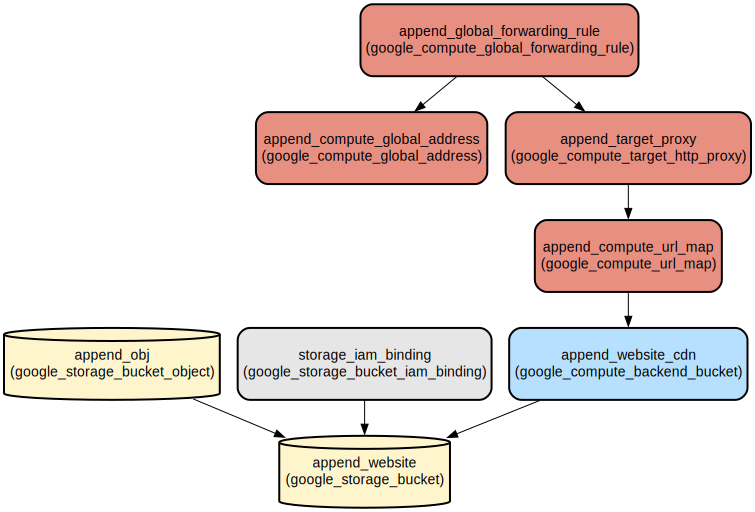

# Modern Website Template with GCP Infrastructure Deployment

This project provides a responsive Bootstrap website template with automated Google Cloud Platform (GCP) infrastructure deployment. It combines a modern, feature-rich website template with Infrastructure as Code (IaC) capabilities for seamless cloud hosting.

The template offers a comprehensive set of features including responsive navigation, animations, blog functionality, and portfolio showcasing. The infrastructure component automates the deployment process using Terraform to set up a fully configured GCP environment with CDN capabilities and global load balancing.

## Repository Structure
```
.
├── src/                          # Website source files
│   ├── assets/                   # Static assets (CSS, JS, vendor libraries)
│   │   ├── css/                 # Custom CSS styles
│   │   ├── js/                  # Custom JavaScript functionality
│   │   ├── scss/               # SCSS source files (Pro version only)
│   │   └── vendor/             # Third-party libraries (Bootstrap, AOS, etc.)
│   ├── forms/                    # Contact form handling
│   └── *.html                    # Website pages (index, blog, portfolio, etc.)
└── terraform/                    # Infrastructure as Code
    ├── main.tf                   # Main Terraform configuration
    ├── variables.tf              # Variable definitions
    ├── outputs.tf                # Output definitions
    ├── provider.tf               # Provider configuration
    └── scripts/                  # Helper scripts
```

## Usage Instructions
### Prerequisites
- Node.js (for development tools)
- Python 3.x (for MIME type detection script)
- Terraform >= 1.0
- Google Cloud SDK
- A Google Cloud Platform account with billing enabled

### Installation

1. Clone the website template:
```bash
git clone <repository-url>
cd <repository-name>
```

2. Set up GCP credentials:
```bash
gcloud auth application-default login
```

3. Initialize Terraform:
```bash
cd terraform
terraform init
```

### Quick Start
1. Configure website content:
   - Modify HTML files in `src/` directory
   - Update styles in `src/assets/css/main.css`
   - Customize JavaScript in `src/assets/js/main.js`

2. Deploy to GCP:
```bash
cd terraform
terraform plan
terraform apply
```

### More Detailed Examples

#### Customizing the Navigation Menu
```html
<nav id="navmenu" class="navmenu">
  <ul>
    <li><a href="index.html#hero">Home</a></li>
    <li><a href="index.html#about">About</a></li>
    <!-- Add more menu items -->
  </ul>
</nav>
```

#### Adding Blog Posts
```html
<article>
  <div class="post-img">
    
  </div>
  <p class="post-category">Category</p>
  <h2 class="title">
    <a href="blog-details.html">Post Title</a>
  </h2>
</article>
```

### Troubleshooting

#### Common Issues
1. MIME Type Detection Failure
   - Error: "Unable to determine MIME type"
   - Solution: Ensure Python 3.x is installed and the script has execution permissions
   ```bash
   chmod +x terraform/scripts/get_mime_type.py
   ```

2. GCP Deployment Issues
   - Error: "Permission denied"
   - Solution: Verify GCP credentials and project access
   ```bash
   gcloud auth list
   gcloud config set project YOUR_PROJECT_ID
   ```

## Data Flow
The website template processes and serves content through a CDN-enabled infrastructure on GCP.

```ascii
[Client Browser] → [Global Load Balancer] → [Cloud CDN] → [Cloud Storage Bucket]
                                                            ↑
[Local Development] → [Terraform] → [GCP Infrastructure] ───┘
```

Component Interactions:
1. Terraform creates and configures GCP resources
2. Website files are uploaded to Cloud Storage
3. Cloud CDN caches content for improved performance
4. Global Load Balancer routes traffic to nearest CDN edge
5. Client requests are served from optimal locations

## Infrastructure


- **Storage**:
  - google_storage_bucket.append_website: Main website content bucket
  - google_storage_bucket_object.append_obj: Website files

- **CDN and Load Balancing**:
  - google_compute_backend_bucket.append_website_cdn: CDN backend configuration
  - google_compute_global_address.append_compute_global_address: Global IP reservation
  - google_compute_url_map.append_compute_url_map: URL routing rules
  - google_compute_target_http_proxy.append_target_proxy: HTTP proxy configuration
  - google_compute_global_forwarding_rule.append_global_forwarding_rule: Global load balancing

## Deployment
1. Prerequisites:
   - GCP project with billing enabled
   - Terraform installed
   - Google Cloud SDK configured

2. Deployment Steps:
```bash
# Initialize Terraform
terraform init

# Review changes
terraform plan

# Apply infrastructure
terraform apply

# Verify deployment
terraform output website_url
```